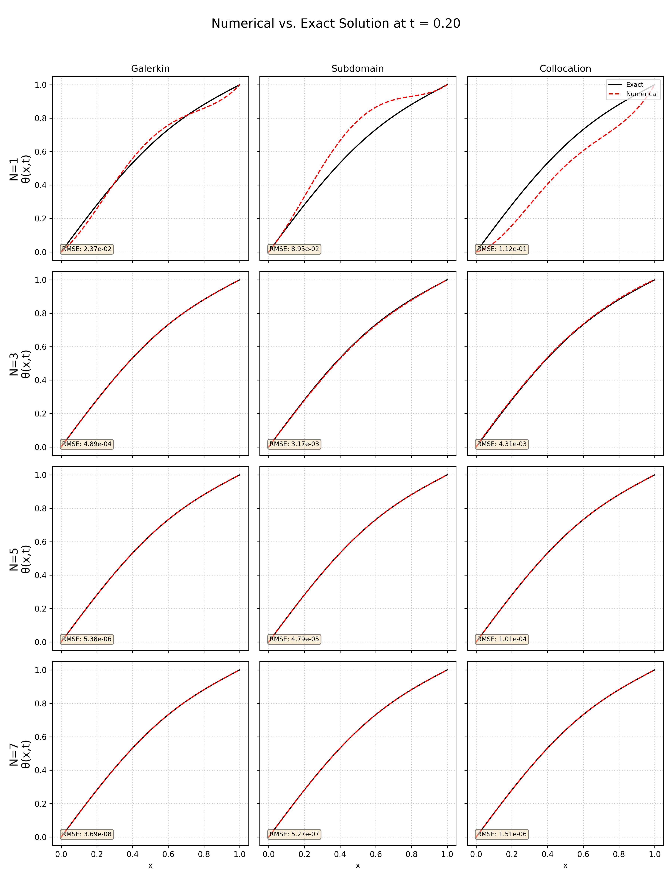

# 求解一维热传导方程的加权残量法-计算结果与分析
姓名：李波澳&nbsp;&nbsp;&nbsp;&nbsp;学号：22406111

### 数值解与精确解比较图

第2页的图1展示了在 $t=0.20$ 时，不同方法和不同 $N$ 值下的数值解（红色虚线）与精确解（黑色实线）的比较，并在每个子图中显示了均方根误差 (RMSE)。

### 系数 $a_j(t=0.20)$ 计算结果 (保留四位小数)

下表展示了在 $t=0.20$ 时，不同方法和不同 $N$ 值下计算得到的系数 $a_j$ 的值。

**伽辽金法 (Galerkin)**

| N |  $a_1$  |  $a_2$  |  $a_3$  |  $a_4$  |  $a_5$  |  $a_6$  |  $a_7$  |
|:-:|:-------:|:-------:|:-------:|:-------:|:-------:|:-------:|:-------:|
| 1 | -3.3028 |         |         |         |         |         |         |
| 3 | -2.6806 | -3.0424 |  3.0424 |         |         |         |         |
| 5 | -2.7056 | -2.6935 |  1.6484 |  2.0902 | -1.0451 |         |         |
| 7 | -2.7052 | -2.7054 |  1.7473 |  1.7278 | -0.3929 | -0.5652 |  0.1884 |

**子区域法 (Subdomain)**

| N |  $a_1$  |  $a_2$  |  $a_3$  |  $a_4$  |  $a_5$  |  $a_6$  |  $a_7$  |
|:-:|:-------:|:-------:|:-------:|:-------:|:-------:|:-------:|:-------:|
| 1 | -2.8566 |         |         |         |         |         |         |
| 3 | -2.6989 | -3.0375 |  3.0375 |         |         |         |         |
| 5 | -2.7053 | -2.6910 |  1.6324 |  2.1172 | -1.0586 |         |         |
| 7 | -2.7052 | -2.7055 |  1.7486 |  1.7227 | -0.3837 | -0.5732 |  0.1911 |

**配点法 (Collocation)**

| N |  $a_1$  |  $a_2$  |  $a_3$  |  $a_4$  |  $a_5$  |  $a_6$  |  $a_7$  |
|:-:|:-------:|:-------:|:-------:|:-------:|:-------:|:-------:|:-------:|
| 1 | -3.9385 |         |         |         |         |         |         |
| 3 | -2.5995 | -3.3218 |  3.3218 |         |         |         |         |
| 5 | -2.7090 | -2.6683 |  1.5700 |  2.1965 | -1.0983 |         |         |
| 7 | -2.7051 | -2.7063 |  1.7522 |  1.7131 | -0.3691 | -0.5849 |  0.1950 |

### 均方根误差 (RMSE) 总结

下表总结了在 $t=0.20$ 时，不同方法和不同 $N$ 值下的均方根误差：

| Method      |     N=1 |       N=3 |       N=5 |       N=7 |
| :---------- | ------: | --------: | --------: | --------: |
| Galerkin    | 2.366e-02 | 4.886e-04 | 5.376e-06 | 3.686e-08 |
| Subdomain   | 8.948e-02 | 3.166e-03 | 4.791e-05 | 5.268e-07 |
| Collocation | 1.125e-01 | 4.307e-03 | 1.010e-04 | 1.505e-06 |

### 结果分析

从上图和 RMSE 表格可以看出：

1.  **收敛性：** 对于所有三种方法，随着 $N$ 值的增加（即近似解中使用的基函数数量增加），数值解的精度都显著提高，RMSE 值减小。这表明这些方法对于此问题是收敛的。
2.  **精度比较：**
    *   **伽辽金法 (Galerkin)** 在相同的 $N$ 值下通常能提供最高的精度（最小的 RMSE）。它的收敛速度也最快，尤其是在 $N$ 较大时，误差迅速减小到非常低的水平。
    *   **子区域法 (Subdomain)** 的精度介于伽辽金法和配点法之间。
    *   **配点法 (Collocation)** 在相同的 $N$ 值下精度相对较低，但其实现最为简单，因为它避免了积分运算。
3.  **图像吻合度：** 当 $N$ 增加到 5 或 7 时，对于伽辽金法，数值解曲线与精确解曲线在视觉上几乎完全重合。其他方法在 $N=7$ 时也表现出很好的吻合度。

## 实现原理概述

本项目通过以下步骤实现数值求解：

1.  **近似解代入：** 将给定的近似解形式 $\theta_{近似}$ 代入原始的偏微分方程 $\frac{\partial \bar{\theta}}{\partial t} - \frac{\partial^2 \bar{\theta}}{\partial x^2} = 0$，得到一个包含未知系数 $a_j(t)$ 及其时间导数 $\dot{a}_j(t)$ 的**残差方程 $R(x,t) = 0$**。

2.  **加权残量法：** 为了确定 $a_j(t)$，我们应用加权残量法。其核心思想是选择一组权函数 $W_i(x)$，并要求残差在加权积分意义下为零：
    $$ \int_{0}^{1} R(x,t) W_i(x) \, dx = 0 \quad \text{for } i = 1, 2, \dots, N $$
    这会产生 $N$ 个关于 $a_j(t)$ 和 $\dot{a}_j(t)$ 的方程。

3.  **不同方法的权函数选择：**
    *   **伽辽金法：** 权函数 $W_i(x)$ 选择为近似解中的第 $i$ 个基函数，即 $W_i(x) = x^i - x^{i+1}$。积分在整个定义域 $[0,1]$ 上进行。本项目中，这些积分使用辛普森数值积分法计算。
    *   **子区域法：** 将求解域 $[0,1]$ 等分成 $N$ 个子区域。第 $i$ 个权函数 $W_i(x)$ 在第 $i$ 个子区域内为 1，其余为 0。因此，积分 $\int R(x,t) dx = 0$ 在每个子区域上分别执行。本项目中，这些积分是解析计算的。
    *   **配点法：** 在求解域内部选择 $N$ 个离散的配点 $x_i$ (本项目选择等间距点 $x_i = i/(N+1)$ for $i=1 \dots N$)。权函数可以看作是 $W_i(x) = \delta(x-x_i)$，这使得加权残量方程简化为 $R(x_i, t) = 0$，即要求残差在每个配点处精确为零，无需积分。

4.  **常微分方程组 (ODEs)：**
    上述加权残量过程将原始的偏微分方程转化为一个关于 $a_j(t)$ 的一阶常微分方程组，形式通常为：
    $$ \mathbf{M} \frac{d\mathbf{a}}{dt} + \mathbf{K} \mathbf{a} = \mathbf{F} $$
    其中 $\mathbf{a}(t) = [a_1(t), \dots, a_N(t)]^T$，$\mathbf{M}$ 是质量矩阵，$\mathbf{K}$ 是刚度矩阵，$\mathbf{F}$ 是力向量或常数项向量。它们的元素由第3步中的积分或求值过程确定。

5.  **时间积分：**
    将上述 ODE 组改写为标准形式 $\frac{d\mathbf{a}}{dt} = \mathbf{M}^{-1}(\mathbf{F} - \mathbf{K}\mathbf{a})$。
    初始条件由 $\bar{\theta}(x,0) = \sin(\pi x) + x$ 确定，这导致所有 $a_j(0) = 0$。
    然后，使用**四阶龙格-库塔法 (RK4)** 对这个 ODE 系统进行时间积分，从 $t=0$ 到 $t=0.20$，从而求解出 $a_j(t)$ 在每个时间步的值。本项目输出 $a_j(0.20)$。

6.  **精度评估：**
    得到 $a_j(0.20)$ 后，可以构建 $t=0.20$ 时的数值解 $\theta_{近似}(x, 0.20)$，并将其与精确解 $\bar{\theta}_{精确}(x, 0.20)$ 进行比较，通过计算均方根误差 (RMSE) 来量化精度。

## 未来工作与展望

*   实现自适应步长的龙格-库塔方法以提高时间积分效率和精度控制。
*   对配点法的配点选择策略进行研究（如使用高斯点）。
*   扩展到二维问题。
*   将 C++ 计算核心与 Python 绘图更紧密地集成（例如通过 pybind11）。
